<div align="center">




<br>

**English** · [Português](README.pt-br.md)

</div>


## `~$ ps aux | grep interests`

```
PID   USER    CMD
0001  lox     building & jailbreaking AI models
0002  lox     reverse-engineering cheats run by shady devs
0003  lox     cybersecurity research & exploit analysis
0004  lox     tuning Windows internals until it screams
0005  lox     descending to ring-0 when userland says no
0006  lox     shipping slick frontends on the side (yes, really)
```

I break things to understand them, then I write the report nobody asked for. Half my day is terminal-green text on black, the other half is arguing with Framer Motion about easing curves.


## `~$ cat stack.json`

<div align="center">


<br><br>


</div>


## `~$ man lox`

```
NAME
    lox - AI Engineer, Reverse Engineer, professional Linux tourist

DESCRIPTION
    Trains and red-teams AI models — builds jailbreaks to find where the
    guardrails actually break, not just where they claim to.

    Reverse engineers game cheats, mostly the ones built by devs who
    think "shady" is a business model. Same skillset gets pointed at
    cybersecurity work when there's something worth defending.

    Knows Windows internals well enough to make a stock install feel
    like it skipped leg day and started doing cardio. When userland
    isn't deep enough, descends to ring-0 — kernel drivers, hooks,
    and the floors of the OS that don't have a fire exit. Now
    migrating that obsession over to Linux — new territory, same
    energy.

    Occasionally resurfaces to build a frontend, because staring at
    disassembly all day needs a palate cleanser with nice animations.

SEE ALSO
    /var/log/late-night-debugging, ~/.bash_history, coffee(1)
```


## `~$ uptime --stats`

<div align="center">


<br><br>


</div>


## `~$ ./snake --eat-contributions`

<div align="center">

<picture>
  <source media="(prefers-color-scheme: dark)" srcset="https://raw.githubusercontent.com/lirenzzzin/lirenzzzin/output/snake-dark.svg">
  
</picture>

</div>

<br>

```bash
lox@debian:~$ echo "connect" && sudo shutdown -h now
```

<div align="center">


*disclaimer: no systems were harmed in the making of this README — mostly*

</div>
